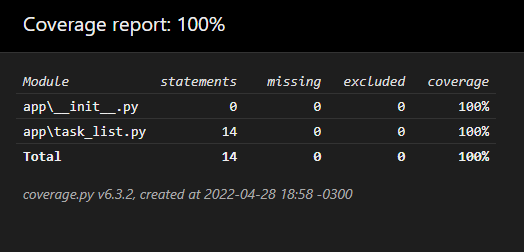

# MY TASK LIST
This project is part of my personal portfolio, and you are invited to contribute.

# Contribute
Everyone is invited to contribute to the project, whether with a fork, some opinion or bug fixes and possible problems.

This project is intended to start my personal portfolio, but I will be very happy if this is useful to someone one day.

# How to start the project?
### System requirements
- Python3.x - The system was developed using version [3.9.7](https://www.python.org/downloads/release/python-397/), but feel free to use version 3.x as you see fit.
- Virtualenv - https://virtualenv.pypa.io/en/latest/installation.html
### Running the project
To start the project, run the following commands in the terminal:
- ``pip install -r requirements.txt``

| Requirement | Version | Reference |
|---|---|---|
| Flask | 2.1.1 | [pip install Flask](https://pypi.org/project/Flask/)
| pytest | 7.1.2 |  [pip install pytest](https://pypi.org/project/pytest/)
| junit-xml | 1.9 | [pip install junit-xml](https://pypi.org/project/junit-xml/)
| coverage | 6.3.2 | [pip install coverage](https://pypi.org/project/coverage/)

# Unit Tests

This project has unit tests that aim to test the application unitarily following the best practices known so far.

To run the unit tests, run the following commands:

``pytest tests -vv --cov=app --junitxml=tests-report.html``

After the tests are done you may want to output the output to an html file to make the coverage easier to read.

So just follow the next two commands.
- ``coverage html`` - Which will read the pytest output file `tests-report.html`.
- ``start .\htmlcov\index.html`` - To view coverage output in your browser. *Note the forward slashes in the terminal, the slashes may be backwards depending on the operating system.*

At the moment the code has 100% test coverage.

# URL's
### BASE_URL
- ``BASE_URL: http://127.0.0.1:5000/`` - The Project is not online yet, it runs locally at this local address.

### URI's
- ``Swagger`` - A documentation with all the URI's can be found in this [LINK](https://9jak84.deta.dev/docs).

# NEXT STEPS
- [ ] ``Think about how to store, edit and retrieve data.``
- [ ] ``Develop logic and apply to streamline the to-do list.``
- [ ] ``Create new routes needed to complete the API.``

# RECENT UPDATES
| Version | Date | Description |
--- | --- | ---
1.0.1 | 2022-04-30 | Change the project to Fast API, to better meet the project proposal and have an online service. |
# my-task-list-fastapi
This project is part of my personal portfolio, and you are invited to contribute.
